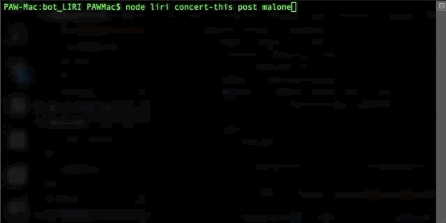

# bot_LIRI
### Language Interpretation and Recognition Interface

LIRI bot is a SIRI knockoff. You can search for concerts, movie details and track details. This is a node.JS tool that must be run via command line.

## Configuration/Install
You will need to create your own .env in the relative path of all the files. Similar to this:  
#Spotify API keys  
SPOTIFY_ID=your-spotify-id  
SPOTIFY_SECRET=your-spotify-secret  

## How to run:
node liri.js concert-this <artist/band name here>

Technologies used: Pure Javascript with the help of Axios, Moment.JS, Spotify API, OMDB API and Bands in Town API.
